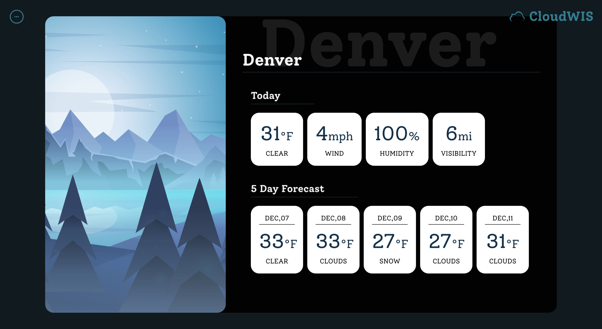
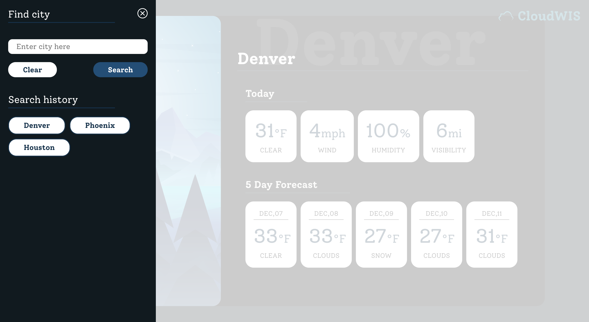
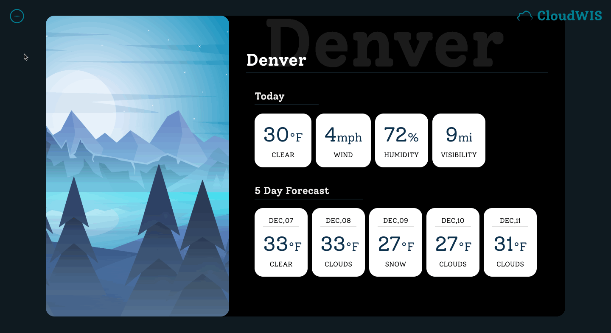

# CloudWIS

Design and code:

[Raisa Primerova](https://github.com/RayRedGoose)

Deployed app: [click here to see](https://rayredgoose.github.io/CloudWIS)

NOTE! For deployed app limited requests API key was used. 

## Overview

**CloudWIS** or Cloud weather information system is web-app for displaying current weather in chosen US city. Current weather information contains today's info of temperature, wind speed, humidity and visibility and 5days weather prediction about temperature and weather state. By default current city is Denver, CO but user can try to choose any US city for displaying. Also app keep user data (current city and search history) and restore it after page was refresh.

## Used technologies

Build with:

- React
- Sass

Test with:

- Jest and Enzyme

## Design

**Weather widget**

**Side menu**

**Loading image**

## Setup

- `clone` the repo to your local machine

- run `npm install` to download all necessary dependencies

- run `npm start` to run the server
